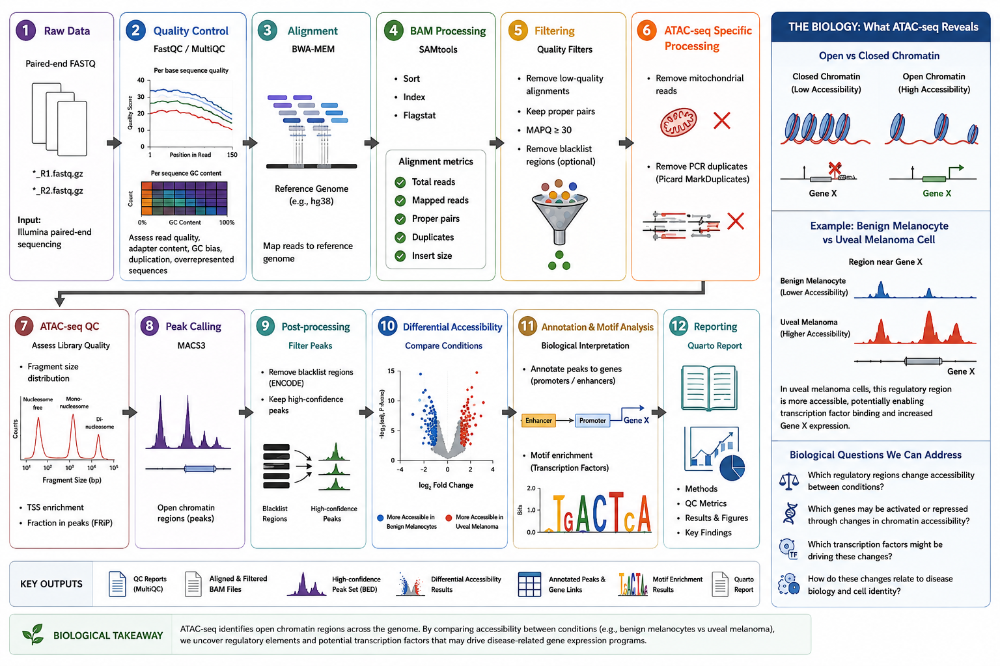

## Overview

ATAC-seq (Assay for Transposase-Accessible Chromatin using sequencing) identifies regions of the genome where chromatin is open and accessible. These accessible regions often contain regulatory elements, such as promoters and enhancers, that help control gene activity.

### Why ATAC-seq?

ATAC-seq can be used to determine which genomic regions are accessible for gene regulation and how accessibility changes between biological conditions.

For example, when comparing **normal melanocytes and melanoma cells**, a regulatory region near a gene may have low accessibility in normal cells but become highly accessible in melanoma cells:

```text id="n8vrqi"
Normal melanocyte
Gene X ───── [closed chromatin]
                    ↓
              Low accessibility

Melanoma cell
Gene X ───── [OPEN chromatin]
                 ↑ ↑ ↑ ↑
              ATAC-seq reads
                    ↓
                ATAC peak
```

A stronger ATAC-seq peak in melanoma cells suggests increased chromatin accessibility at that genomic region. Downstream analysis can then determine whether the region is associated with a promoter or enhancer, which gene it may regulate, and whether specific transcription-factor motifs are enriched.

## Analysis Workflow

<p align="center">
  
</p>

```text id="f6zn0a"
Paired-end FASTQ
      ↓
FastQC / MultiQC
      ↓
BWA-MEM Alignment
      ↓
SAMtools Processing
      ↓
BAM Filtering
      ↓
Mitochondrial Read Removal
      ↓
Duplicate Removal
      ↓
ATAC-Seq Quality Control
      ↓
MACS3 Peak Calling
      ↓
Blacklist Filtering
      ↓
Differential Accessibility
      ↓
Peak Annotation / Motif Analysis
      ↓
Quarto Analysis Report
```

## Tools and Technologies

* Linux
* Python
* BWA-MEM
* SAMtools
* FastQC / MultiQC
* MACS3
* BEDTools
* Nextflow
* Docker
* Quarto

## Analysis

The workflow covers raw-read quality control, paired-end alignment, alignment filtering, mitochondrial-read and duplicate removal, ATAC-seq-specific quality assessment, peak calling, differential chromatin accessibility, peak annotation, motif analysis, and visualization.

## Reproducibility

The completed workflow will use **Nextflow** for workflow orchestration and **Docker** for reproducible software environments.

Quality-control metrics, figures, methods, downstream analyses, and key findings will be presented in a shareable **Quarto analysis report**.

## Repository Structure

```text id="8lckvr"
reproducible-atacseq-analysis/
├── README.md
├── config/
├── scripts/
├── report/
├── results/
└── docs/
    └── images/
```

## Project Status

**In development**

Current focus: preprocessing, quality control, and validation of the ATAC-seq workflow.
